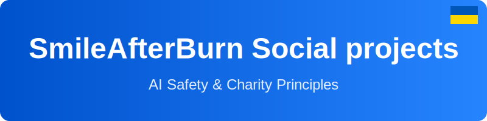

# 🇺🇦 SmileAfterBurn Social Projects

**AI Safety & Charity Principles**

---

## 🎯 Про проект

**SmileAfterBurn** — проект соціальних ініціатив, спрямований на створення інклюзивних рішень для України. Ми розробляємо технології, що змінюють світ на краще.

### 🌟 Основні проекти

- **Інклюзивна мапа послуг України** — TypeScript додаток для пошуку соціальних послуг
- **Inclusive service maps** — Карти сервісів для кожної людини

## 💻 Технологічний стек

- **Frontend:** TypeScript, React
- **Backend:** Node.js, Express
- **Infrastructure:** Google Cloud Run
- **Databases:** Firebase, PostgreSQL

## 🚀 Як почати

```bash
# Клонуємо репозиторій
git clone https://github.com/SmileAfterBurn/smileafterburn-s-projects.git

# Переходимо в директорію
cd smileafterburn-s-projects

# Встановлюємо залежності
npm install

# Запускаємо проект
npm run dev
```

## 🤝 Як внести свій внесок

Ми раді кожному, хто хоче допомогти розвивати наші проекти!

1. **Fork** репозиторій
2. Створіть **Feature Branch** (`git checkout -b feature/AmazingFeature`)
3. **Commit** ваші зміни (`git commit -m 'docs: додано нову функцію'`)
4. **Push** на Branch (`git push origin feature/AmazingFeature`)
5. Відкрийте **Pull Request**

## 📋 Стандарти розробки

- ✅ Коментарі та документація українською мовою
- ✅ Commit messages на українській мові
- ✅ TypeScript strict mode
- ✅ ESLint + Prettier для форматування коду

## 📞 Контакти

- **Email:** illya.vladimirovich@icloud.com
- **GitHub:** [@SmileAfterBurn](https://github.com/SmileAfterBurn)
- **Локація:** 🇺🇦 Ukraine

## 📄 Ліцензія

Цей проект ліцензований під відкритою ліцензією для соціальних проектів.

---

<div align="center">

**Разом ми сильніші! Together we are stronger!** 💙💛

Дякуємо за вашу підтримку!

</div>